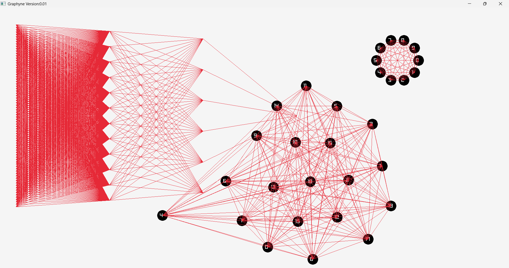

# Graph Visualiser

A graph visualisation library written in **C** using **Raylib**, built for experimenting with graph layout algorithms, physics-based simulation, and real-time rendering.

It supports both **static layouts** and **dynamic force-directed simulations**, with interactive node manipulation and a modular design separating graph structure from rendering and physics logic.

---

## Features

- Multiple graph layout algorithms (static + dynamic)
- Force-directed graph simulation (electrostatic + spring model)
- **Interactive node dragging (click and move nodes)**
- Adjacency-list-based graph representation
- Modular separation between graph structure and rendering/physics
- Built with Raylib for rendering

---

## Rendering Algorithms

### Static Layouts

#### Linear Layout
Nodes are arranged in a straight line, with spline-based edges connecting consecutive nodes. Useful for basic structural visualisation and debugging.

#### Neural Network Layout
Nodes are arranged in layered columns based on a user-defined configuration (nodes per layer), producing a structure similar to a neural network diagram.

---

### Dynamic Layouts

#### Force-Directed Graph (Electrostatic + Spring Model)

A physics-based layout where:

- Nodes repel each other using a distance-based repulsive force
- Edges behave like springs pulling connected nodes together
- The system gradually stabilises into a visually balanced layout

---

## Interaction

The visualiser supports real-time interaction:

- Click and drag nodes to reposition them(only for force system)
- The simulation updates dynamically as nodes are moved
- Manual adjustments can influence the overall layout

---

## Performance

- Graph operations: **O(V + E)**
- Force simulation (naive): **O(V²)** due to pairwise interactions
- Planned improvement: spatial partitioning to reduce unnecessary force calculations. Further research in quadtree algorithm for forces.

### Current scale

- Works with a few thousand nodes in typical use cases
- Responsiveness depends on hardware and graph density

---

## Architecture

The project is split into two main parts:

### Graph Module
Handles graph structure and representation.

- Stores nodes and edges
- Uses adjacency list representation
- Provides basic graph operations

### Rendering Module
Handles simulation and rendering.

- Contains physics-based layout calculations
- Updates node positions over time
- Draws graph using Raylib
- Contains helper data structures that wrap the basic graph strucutre

### Design approach

The separation keeps graph structure independent from rendering and allows physics or layout logic to be modified without changing core graph data structures.

---

## Graph Representation

The graph uses an **adjacency list**, suitable for sparse graphs and efficient traversal. However for the electrostatic forces falls to n-wise comparision for each node.

### Future improvements

- Edge list representation for alternative processing approaches
- Adjacency matrix support for dense graphs
- Hybrid representations depending on graph structure

---

## Dependencies

- [Raylib](https://www.raylib.com/) — graphics and rendering library

## How to Run

The project entry point is `Graphyne.c`, so once the executable is built you can run it directly.

1. Make sure the Raylib folder sits next to this repository as `../raylib-5.5_win64_mingw-w64`.
2. Open a terminal in the `GraphyneC` folder.
3. Build the project with `mingw32-make -f mk.mak`.
4. Run the program with `./graphyne.exe`.

If your Raylib folder is stored somewhere else, update `RAYLIB_DIR` in `mk.mak`.

---

## Design Goals

- Keep the system modular and easy to extend
- Separate graph structure from rendering logic
- Support experimentation with different layout algorithms
- Allow interactive exploration of graphs
- Maintain a simple C-based implementation

---

## Future Work

- Spatial partitioning for force simulation (grid / quadtree)
- GPU-based acceleration experiments
- Node pinning and grouping tools
- Exporting graph states and animations
- Additional layout algorithms (circular, hierarchical, spectral)

---

## Preview

> Add a GIF or screenshot here

---
